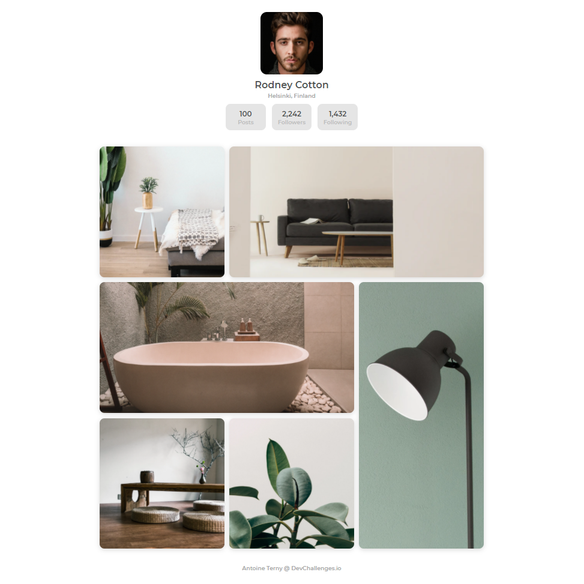

<!-- Please update value in the {}  -->

<h1 align="center">My Gallery</h1>

   Solution for a challenge from  <a href="http://devchallenges.io" target="_blank">Devchallenges.io</a>.

  <h3>
    <a href="https://devchallenges-my-gallery-dist.vercel.app/">
      Demo
    </a>
    <!--  | 
    <a href="https://{your-url-to-the-solution}">
      Solution
    </a> -->
     | 
    <a href="https://devchallenges.io/challenges/gcbWLxG6wdennelX7b8I">
      Challenge
    </a>
  </h3>

<!-- TABLE OF CONTENTS -->

## Table of Contents

- [Overview](#overview)
- [Built With](#built-with)
- [Features](#features)
- [Acknowledgements](#acknowledgements)
- [Contact](#contact)

<!-- OVERVIEW -->

## Overview

Working with css grid is always fun ! It is a small project, but took me about 2 hours, because I had fun with gulp...

### Built With

<!-- This section should list any major frameworks that you built your project using. Here are a few examples.-->

- [Gulp](https://gulpjs.com/), which I used to compile sass, prefix and minify CSS, generate sourcemaps and cache busting postfixes (which is really cool) and also minify the images. I now have a basic gulpfile that I can reuse for my next projects.

## Features

<!-- List the features of your application or follow the template. Don't share the figma file here :) -->

This application/site was created as a submission to a [DevChallenges](https://devchallenges.io/challenges) challenge. The [challenge](https://devchallenges.io/challenges/gcbWLxG6wdennelX7b8I) was to build an application to complete the given user stories.

## Acknowledgements

<!-- This section should list any articles or add-ons/plugins that helps you to complete the project. This is optional but it will help you in the future. For exmpale -->

- [MDN web docs](https://developer.mozilla.org/), as always, to get information about filter: drop-shadow() and object-fit CSS properties.

## Contact

- Website [antoineteny.com](https://{your-web-site-link})
- GitHub [@antoineterny](https://{github.com/your-usermame})
